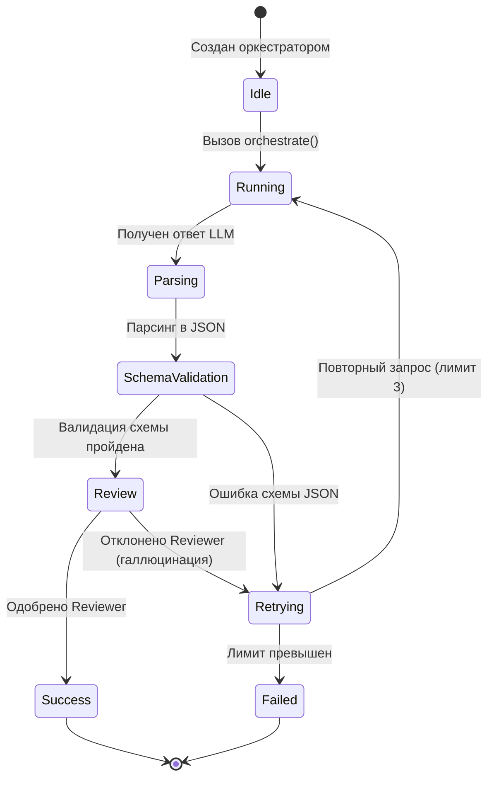

# Мультиагентная Система (Agents System & Coordination)

В данном документе описывается структура, протоколы взаимодействия и координация ИИ-агентов в системе **Portfolio Factory**.

---

## Архитектура Агентного Слоя

Система использует **конвейерно-ациклическую (Pipeline/DAG)** структуру координации. Каждый агент представляет собой независимый функциональный блок с четко очерченными границами ответственности, входами и выходами.

```
       [Вход: Резюме + GitHub]
                  │
                  ▼
          ┌───────────────┐
          │Context Manager│
          └───────┬───────┘
                  │ (knowledge.json)
                  ▼
         ┌─────────────────┐
         │Project Extractor│
         └────────┬────────┘
                  │ (project.json)
         ┌────────┴────────┬─────────────────┐
         ▼                 ▼                 ▼
 ┌─────────────┐   ┌──────────────┐   ┌───────────────┐
 │Resume Writer│   │Diagram Builder│   │README Generat.│
 └─────────────┘   └───────┬──────┘   └───────┬───────┘
                           │                  │
                           ▼                  ▼
                  ┌─────────────────┐ ┌───────────────┐
                  │Arch. Writer     │ │Portfolio Gen. │
                  └─────────────────┘ └───────┬───────┘
                                              │ (portfolio.json)
                                              ▼
                                         ┌─────────┐
                                         │Reviewer │
                                         └────┬────┘
                                              │ (Утверждено)
                                              ▼
                                         ┌─────────┐
                                         │Publisher│
                                         └─────────┘
```

---

## Протокол Взаимодействия и Формат Данных

Агенты обмениваются информацией асинхронно через центральный Context Manager и хранилище сессии. Данные сериализуются в формат JSON и проходят валидацию.

1.  **Запрос к агенту**: Оркестратор вызывает агента, передавая ему системный промпт (из `prompts/`), конфигурацию модели (из `config/models.yaml`) и входной JSON, соответствующий схеме.
2.  **Обработка**: Агент отправляет структурированный запрос к LLM, используя шаблоны промптов с жесткими ограничениями (XML-теги).
3.  **Валидация выхода**: Полученный от LLM текст парсится в JSON. Этот JSON валидируется на соответствие JSON-схеме. Если валидация не пройдена, отправляется повторный корректирующий запрос (self-correction loop).
4.  **Сохранение**: При успешном выполнении результат сохраняется в `context/` и становится доступен для последующих агентов в цепочке.

---

## Список Агентов и Спецификации

Каждый агент подробно описан в отдельном файле документации:

1.  **[Context Manager](file:///c:/projects/portfolio_factory/docs/agents/context_manager.md)**: Управляет первичным сбором информации и агрегацией пользовательских фактов.
2.  **[Project Extractor](file:///c:/projects/portfolio_factory/docs/agents/project_extractor.md)**: Анализирует код репозиториев и выявляет ключевые проекты, задачи, стек и достижения.
3.  **[Resume Writer](file:///c:/projects/portfolio_factory/docs/agents/resume_writer.md)**: Генерирует лаконичное профессиональное резюме инженера на основе извлеченных фактов.
4.  **[Architecture Writer](file:///c:/projects/portfolio_factory/docs/agents/architecture_writer.md)**: Описывает высокоуровневую архитектуру репозиториев, паттерны проектирования и потоки данных.
5.  **[Diagram Builder](file:///c:/projects/portfolio_factory/docs/agents/diagram_builder.md)**: Генерирует код Mermaid-диаграмм на основе текстового описания архитектуры.
6.  **[README Generator](file:///c:/projects/portfolio_factory/docs/agents/readme_generator.md)**: Создает профессиональные README.md для репозиториев проектов на GitHub.
7.  **[Portfolio Generator](file:///c:/projects/portfolio_factory/docs/agents/portfolio_generator.md)**: Компонует данные для создания статического веб-сайта портфолио.
8.  **[Reviewer](file:///c:/projects/portfolio_factory/docs/agents/reviewer.md)**: Выполняет аудит качества сгенерированных текстов, предотвращая галлюцинации LLM.
9.  **[Publisher](file:///c:/projects/portfolio_factory/docs/agents/publisher.md)**: Отвечает за коммиты README и публикацию сайта на GitHub Pages.

---

## Жизненный Цикл Агента (State Machine)


