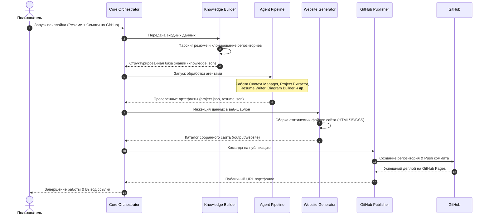
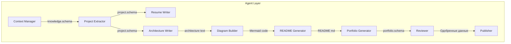

# Архитектурный Обзор Системы (System Architecture)

В данном документе приведено детальное описание архитектуры платформы **Portfolio Factory**, ее подсистем, потоков данных и принципов проектирования.

---

## Архитектурные Принципы
1.  **Слабая связанность (Loose Coupling)**: Компоненты взаимодействуют исключительно через строго типизированные интерфейсы и JSON-контракты (JSON Schema). Изменения в одном агенте не должны влиять на работу других.
2.  **Единственная ответственность (Single Responsibility)**: Каждый агент решает только одну задачу (например, извлечение проектов, валидация данных, рендеринг диаграмм).
3.  **Детерминизм и контроль качества**: Результаты генерации ИИ-агентов валидируются программными схемами и специальным агентом-ревьюером для минимизации галлюцинаций.
4.  **Разделение логики и данных (Data-Logic Separation)**: Конфигурации, промпты и шаблоны вынесены из кода в декларативные файлы.

---

## Сквозной Поток Данных (End-to-End Dataflow)

Процесс обработки данных делится на 4 основных этапа:
1.  **Построение Знаний (Knowledge Building)**: Парсинг сырого резюме пользователя и статический анализ целевых репозиториев на GitHub.
2.  **Работа Конвейера Агентов (Agent Pipeline Execution)**: Последовательное обогащение информации о проектах, генерация текстов, выявление достижений и подготовка архитектурных диаграмм.
3.  **Сборка Сайта (Website Generation)**: Инжектирование структурированных данных в выбранный шаблон и рендеринг статического сайта.
4.  **Публикация (GitHub Publishing)**: Создание репозитория на GitHub, запись файлов и запуск сборщика на GitHub Pages.

---

## Подсистемы и Слои Архитектуры

### 1. Ядро и Оркестрация (Core Layer)
Слой ядра (`core/`) управляет общим жизненным циклом выполнения. Оркестратор (`core/orchestrator.py`):
- Загружает настройки из `config/`.
- Выстраивает направленный ациклический граф (DAG) выполнения агентов на основе конфигурации `config/agents.yaml`.
- Обеспечивает обмен контекстом сессии (`context/`).
- Выполняет сбор метрик и логирование в `logs/`.

### 2. Мультиагентный Слой (Agent Layer)
Агенты (`agents/`) делятся на специализированные типы:
- **Агенты Анализа**: `Project Extractor` (анализ исходного кода и фиксация архитектуры), `Context Manager` (сбор исходной информации).
- **Агенты Генерации**: `Resume Writer` (составление лаконичного резюме), `Diagram Builder` (создание архитектурных схем Mermaid), `README Generator` (создание файлов описания для GitHub).
- **Агенты Контроля**: `Reviewer` (проверка соответствия сгенерированного контента фактам из базы знаний, исключение галлюцинаций).

### 3. Слой Данных и Хранилищ (Data & Knowledge Layer)
- **Входной буфер** (`input/`): Хранит физические исходные файлы.
- **База Знаний** (`knowledge/`): Представляет собой базу фактов, извлеченных из резюме разработчика и анализа его кода. Содержит граф связей технологий, проектов и опыта.
- **JSON Схемы** (`schemas/`): Обеспечивают автоматическую валидацию (с использованием библиотеки `jsonschema`) на каждом шаге конвейера.

### 4. Слой Интеграций (Service Layer)
- **GitHub API Service**: Отвечает за выгрузку коммитов, создание репозиториев, коммиты сгенерированных README.md и развертывание.
- **Diagrams Service**: Предоставляет обертку над CLI-утилитами для компиляции текстового описания Mermaid в графику SVG/PNG.
- **Website Generator Service**: Вызывает процесс сборки статического сайта (SSG) на базе Astro/Next.js/HTML шаблонов.

---

## Валидация и Исключение Галлюцинаций

Для предотвращения недостоверных данных в портфолио в архитектуру заложен двухэтапный механизм верификации:
1.  **Синтаксический контроль (Schema Validation)**: Выходные данные каждого агента, предоставляемые в формате JSON, проходят автоматическую валидацию на соответствие JSON-схеме перед передачей следующему шагу. При несоответствии агент перезапускается с сообщением об ошибке форматирования.
2.  **Семантический аудит (Agent Review Loop)**: Специализированный агент `Reviewer` берет сгенерированные артефакты и сопоставляет их с исходными фактами из `knowledge.json`. Если обнаруживается несоответствие (например, преувеличение метрик проекта, упоминание технологий, которых нет в коде или резюме), артефакт отправляется на повторную генерацию с указанием причин отклонения.

Подробное описание каждого агента и его интерфейсов приведено в файле [Agents.md](file:///c:/projects/portfolio_factory/Agents.md).
