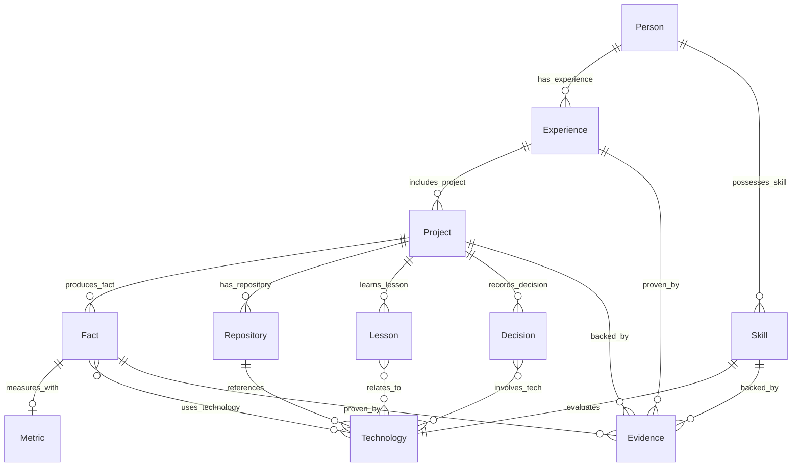

# Схема Сущностей и Связей (Entity Relationship Diagram)

В данном документе приведена диаграмма сущностей и связей новой **Инженерной базы знаний (Engineering Knowledge Base)** платформы **Portfolio Factory**.

---

## 1. ER-диаграмма связей графа знаний

Связи в графе знаний построены на основе ссылочной целостности по уникальным идентификаторам (IDs). Каждое ребро графа направлено и отражает логическую подчиненность или владение.

---

## 2. Спецификация вершин графа (Сущностей)

### 2.1. Группа Профиля
*   `Person`: Агрегирует ФИО, контакты, саммари и общие метаданные кандидата.
*   `Experience`: Модель стажа работы (компания, должность, даты начала/окончания). Ссылается на проекты через список `projects` (внешний ключ).
*   `Skill`: Количественная оценка (уровень владения, стаж, даты использования) кандидата в рамках конкретной `Technology`.

### 2.2. Группа Разработки и Реализации
*   `Project`: Самостоятельный объект проекта. Хранит описание, роль, стек, архитектурные диаграммы и списки ссылок на факты, уроки, решения и коммиты.
*   `Repository`: Отражает характеристики репозитория на GitHub (языки, фреймворки, звезды, видимость, файл README).
*   `Technology`: Глобальный справочник библиотек и языков (FastAPI, pgvector). Содержит ссылки на документацию и вендора.

### 2.3. Группа Метрик и Доказательств
*   `Fact`: Конкретное атомарное достижение (например, «Внедрение идемпотентного ETL»). Ссылается на задействованные технологии, метрики и доказательства.
*   `Metric`: Структурированная сущность количественного сравнения параметров «до» и «после» оптимизации.
*   `Evidence`: Ссылка на вещественное доказательство существования опыта (номера строк кода в файле Git-репозитория, хэш коммита, сертификат PDF).

### 2.4. Группа Знаний и Решений
*   `Lesson`: Извлеченный инженерный урок (категория, проблема, решение, связи с технологиями).
*   `Decision`: Архитектурное решение (почему был выбран SOAP вместо REST, компромиссы, последствия).
