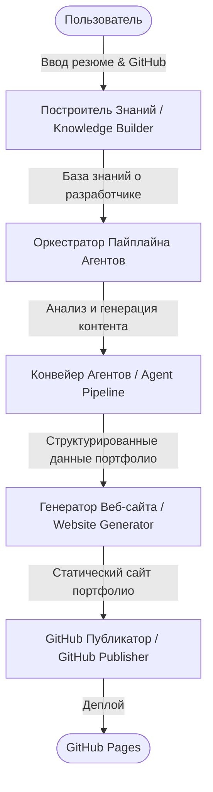

# Portfolio Factory — Платформа Автоматической Генерации Портфолио

Portfolio Factory — это модульная мультиагентная система промышленного уровня, предназначенная для автоматического преобразования инженерного опыта разработчика в комплексное профессиональное портфолио.

## Наша Миссия
Автоматизировать процесс создания портфолио, избавляя инженеров от рутины описания своих проектов. Система анализирует исходные резюме, текстовые описания и код репозиториев на GitHub, извлекает измеримые достижения и архитектурные решения, а затем генерирует готовый к развертыванию статический сайт и качественные файлы README для проектов.

---

## Архитектура Системы (Обзор)
Система разработана по модульному принципу и состоит из слабо связанных компонентов, взаимодействующих через типизированные JSON-контракты. 



Подробное описание архитектуры находится в файле [Architecture.md](file:///c:/projects/portfolio_factory/Architecture.md).

---

## Структура Репозитория

Проект имеет следующую структуру каталогов:

*   [agents/](file:///c:/projects/portfolio_factory/agents) — Логика и обработчики ИИ-агентов.
*   [config/](file:///c:/projects/portfolio_factory/config) — Системные и агентские конфигурации.
*   [context/](file:///c:/projects/portfolio_factory/context) — Контекст выполнения и память сессии.
*   [core/](file:///c:/projects/portfolio_factory/core) — Оркестратор и базовые абстракции ядра.
*   [docs/](file:///c:/projects/portfolio_factory/docs) — Техническая документация и спецификации агентов.
*   [examples/](file:///c:/projects/portfolio_factory/examples) — Примеры входных данных и демонстрации.
*   [input/](file:///c:/projects/portfolio_factory/input) — Исходные файлы пользователя (резюме, ссылки).
*   [knowledge/](file:///c:/projects/portfolio_factory/knowledge) — Локальная база знаний и поисковый движок.
*   [logs/](file:///c:/projects/portfolio_factory/logs) — Логи выполнения системы.
*   [output/](file:///c:/projects/portfolio_factory/output) — Результаты работы (сайты, диаграммы, резюме).
*   [projects/](file:///c:/projects/portfolio_factory/projects) — Анализатор структуры и кода проектов.
*   [prompts/](file:///c:/projects/portfolio_factory/prompts) — Шаблоны промптов ИИ-агентов.
*   [schemas/](file:///c:/projects/portfolio_factory/schemas) — JSON-схемы контрактов обмена данными.
*   [scripts/](file:///c:/projects/portfolio_factory/scripts) — Скрипты автоматизации и CI/CD.
*   [services/](file:///c:/projects/portfolio_factory/services) — Интеграция с GitHub, Mermaid CLI и сборщиками сайтов.
*   [templates/](file:///c:/projects/portfolio_factory/templates) — Шаблоны документов и тем оформления.
*   [tests/](file:///c:/projects/portfolio_factory/tests) — Тесты (Unit, Integration, Agent Mocks).

---

## Быстрый Старт (Концептуально)
После реализации системы, запуск будет производиться следующей командой:

```bash
# Инициализация окружения
python -m venv .venv
source .venv/bin/activate
pip install -r requirements.txt

# Запуск генерации портфолио
python -m core.orchestrator --config config/settings.yaml --input input/resume.pdf
```

Подробные инструкции по установке и настройке приведены в руководстве [Development.md](file:///c:/projects/portfolio_factory/Development.md).

## Документация
Для детального изучения проекта ознакомьтесь со следующими материалами:
- [Архитектурный обзор (Architecture.md)](file:///c:/projects/portfolio_factory/Architecture.md)
- [Мультиагентная архитектура (Agents.md)](file:///c:/projects/portfolio_factory/Agents.md)
- [Дорожная карта (Roadmap.md)](file:///c:/projects/portfolio_factory/Roadmap.md)
- [Руководство по разработке (Development.md)](file:///c:/projects/portfolio_factory/Development.md)
- [Как внести свой вклад (Contributing.md)](file:///c:/projects/portfolio_factory/Contributing.md)
- [Список задач и бэклог (TODO.md)](file:///c:/projects/portfolio_factory/TODO.md)
