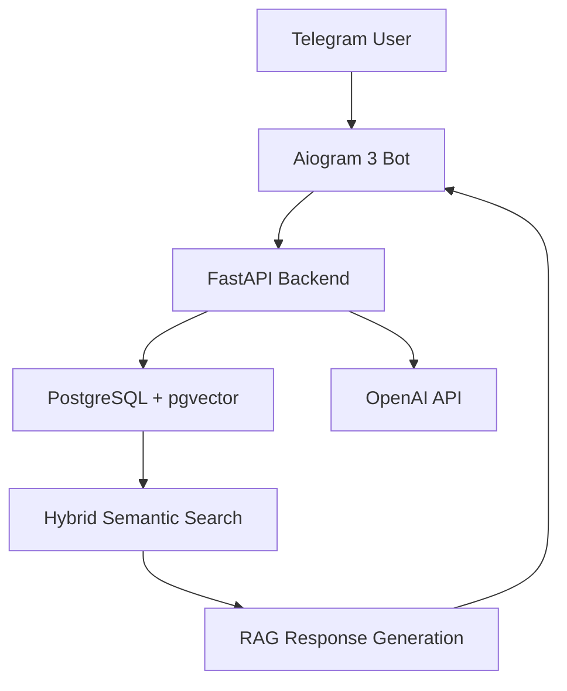

# SaaS AI-консультант для e-commerce каталога

    

> **Status**: Production  
> **Type**: Commercial

## Overview
AI-ассистент для автоматизированной консультации клиентов по каталогу из 370+ SKU. Реализована RAG-система с гибридным семантическим поиском и Telegram-интерфейсом.

## Architecture & Pipeline

## Tech Stack
- **Python**
- **PostgreSQL**
- **pgvector**
- **OpenAI API**
- **Aiogram 3**
- **FastAPI**

---
*This README was automatically generated based on the Portfolio Knowledge Graph.*
