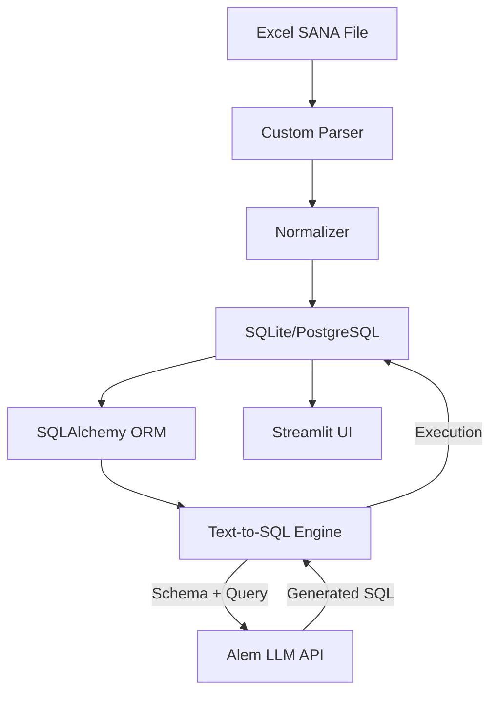

# On-Premise AI-платформа для анализа строительных смет

    

> **Status**: Mvp  
> **Type**: Pet_project

## Overview
Локальная AI-платформа для парсинга Excel-смет (SANA), нормализации данных и аналитики через Text-to-SQL. Архитектура Zero Data Leak для защиты конфиденциальности.

## Architecture & Pipeline

## Tech Stack
- **Python**
- **Pandas**
- **SQLAlchemy**
- **Streamlit**
- **Alem LLM API**
- **SQLite**
- **Excel**

## Engineering Decisions & Lessons Learned
### Подготовка данных занимает больше всего времени
Большинство времени занимает не работа LLM, а подготовка и нормализация данных. Качество парсинга напрямую влияет на результат AI-системы.

### Специализированные парсеры для Excel
Excel-документы инженерного назначения требуют специализированных парсеров — универсальные библиотеки не всегда подходят для сложной структуры смет.

### Text-to-SQL снижает порог входа
Text-to-SQL позволяет значительно снизить порог входа для пользователей, не владеющих SQL, предоставляя доступ к аналитике на естественном языке.

### Разделение генерации и выполнения SQL
Конфиденциальные данные можно эффективно защищать, разделяя генерацию SQL и выполнение запросов. Во внешнюю LLM передаются только схема и вопрос, данные остаются локально.

### Streamlit для быстрого MVP
Streamlit хорошо подходит для быстрого создания MVP и проверки инженерных гипотез, но для промышленной эксплуатации потребуются более масштабируемые решения.

---
*This README was automatically generated based on the Portfolio Knowledge Graph.*
