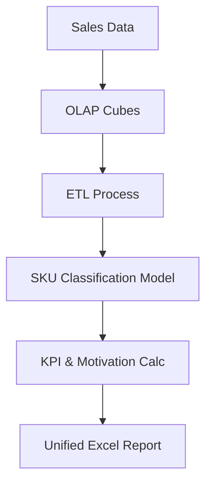

# Автоматизация аналитики продаж и расчета KPI

 

> **Status**: Production  
> **Type**: Commercial

## Overview
ETL-процесс подготовки управленческой отчетности, классификация ассортимента и автоматизация расчета мотивации торговой команды на базе OLAP и Excel.

## Architecture & Pipeline

## Tech Stack
- **Excel**
- **OLAP Cubes**

---
*This README was automatically generated based on the Portfolio Knowledge Graph.*
