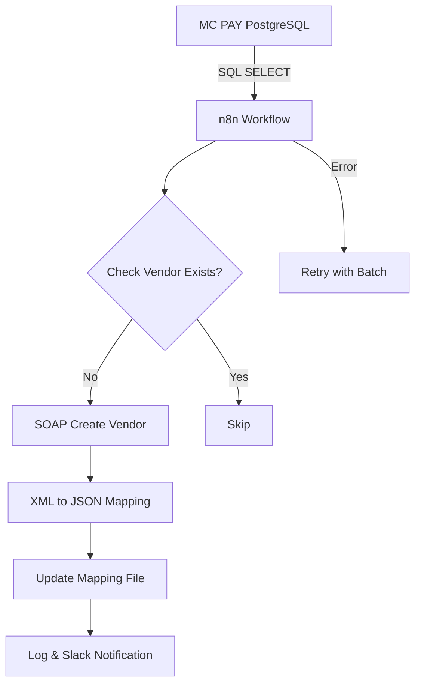

# MC PAY -> NAV Integration

    

> **Status**: Production  
> **Type**: Commercial

## Overview
ETL-пайплайн синхронизации биллинговой платформы MC PAY с ERP Microsoft Dynamics NAV. Автоматизация создания контрагентов, идемпотентная обработка, логирование и уведомления.

## Architecture & Pipeline

## Tech Stack
- **n8n**
- **PostgreSQL**
- **SOAP Web Services**
- **XML**
- **JSON**
- **Slack API**
- **Microsoft Dynamics NAV / Business Central**

## Engineering Decisions & Lessons Learned
### Идемпотентность обязательна для ETL
Идемпотентность является обязательным свойством для любых ETL-процессов, работающих по расписанию. Проверка существования записей по бизнес-идентификатору предотвращает дублирование при повторных запусках.

### SOAP эффективен для корпоративных ERP
SOAP остается эффективным инструментом для интеграции корпоративных ERP-систем и обеспечивает высокую производительность при работе с большими объемами данных.

### UI оркестратора как узкое место
Основным узким местом интеграции может быть не ERP, а инструмент оркестрации или пользовательский интерфейс. При обработке >30 000 записей требуется пакетная обработка.

### Важность тестовой среды
Полноценная тестовая среда значительно снижает риски при внедрении изменений в production. Тестирование в Sandbox-копии ERP обязательно перед публикацией.

### Координация с администраторами ERP
При работе с enterprise-системами важную роль играет взаимодействие с администраторами и поставщиками ERP (настройка доступов, публикация сервисов, изменение конфигурации).

---
*This README was automatically generated based on the Portfolio Knowledge Graph.*
